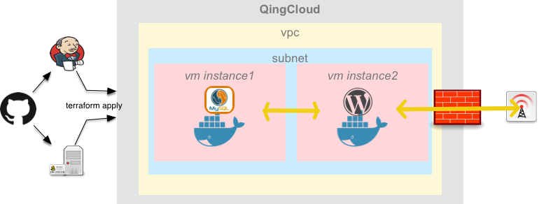
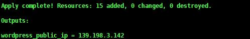
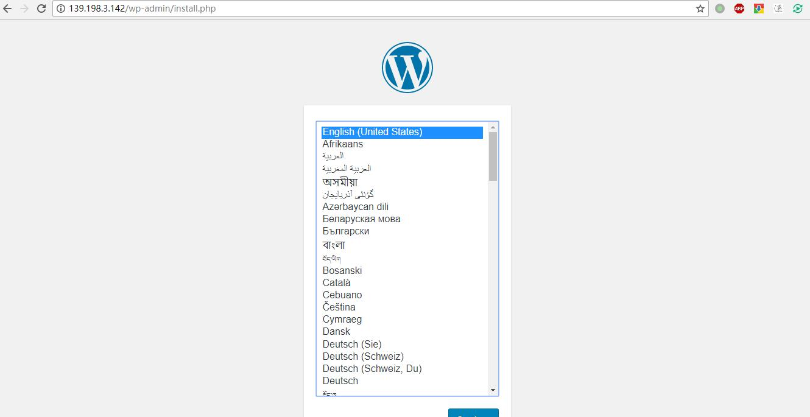

# Terraform - Infrastructure as Code

## 什么是Terraform？

Terraform是一个安全、高效的进行基础设施的部署、更改、版本化的工具。  

Terraform用配置文件来描述应用所需的组件。 
Terraform会根据配置文件生成一个执行计划，这个计划会列出为达到所需的状态而执行的操作，然后执行计划以达到期望的状态。  
如果配置被更改，Terraform能够通过比对得到更改的内容，并创建对应的增量执行计划。 
terraform通过插件机制管理不同的资源提供者，以此来接入各种资源，如虚拟机，存储，网络和各种应用服务。

## Terraform的主要特性

### Infrastructure as Code

基础架构使用配置语法进行描述，这可以让数据中心的构建计划可以像其他代码一样进行版本化和追踪。

### Execution Plans

Terraform有一个规划步骤，它生成一个执行计划。  
执行计划显示当您调用应用程序时Terraform将执行的操作。  
使用这个功能可以保证操作基础设施时不发生意外。

### Resource Graph

Terraform创建了一个所有资源的视图。这使得Terraform可以并行化没有依赖的创建与修改。  
因此，Terraform可以高效地构建基础架构。操作员也能更加了解环境的结构。 

### Change Automation

Terraform会自动的分析什么是需要修改的，从而避免了许多可能的人为错误。

## Terraform vs. Other Software

与Terraform类似的Infrastructure as Code工具大概有下面几种：

* [Chef](https://www.chef.io)
* [Puppet](https://puppet.com)
* [Ansible](https://www.ansible.com)
* [SaltStack](https://saltstack.com)
* [CloudFormation](https://aws.amazon.com/cn/cloudformation)

下面将从几个方面来说明Terraform与其他工具对比的优势

### 配置管理工具与编排工具

Chef, Puppet, Ansible, and SaltStack 都可以称为配置管理工具，这些工具的主要目标是在已经存在的机器上安装和管理软件。  
而Terraform和CloudFormation 可以称为编排工具，更注重于数据中心以及相关服务的高级抽象。他们的工作重点是创建资源并且引导进行初始化。  
而且在现在的环境下，大家使用容器等服务，镜像已经包括了软件的安装与配置。一旦你有了镜像，你需要的是一些服务器去运行它。  
对于提供服务器这种需求，编排工具会比配置管理工具更适合做此类工作。  

### 编程式语言与声明式语言

Chef and Ansible希望你去一步步编写程序以达到最终所期望的状态。  
Terraform, CloudFormation, SaltStack, and Puppet希望你去声明最终想要的资源与资源的状态，工具本身会自动分析达到想要的状态需要进行怎样的操作。  
在使用编程式语言时，工具不会获取历史的状态，所以我们需要考虑的更多以达到与之前版本的兼容。  
并且使用编程式语言会导致代码库变得越来越庞大，不利于人们理解与代码的复用。  
不过声明式的语言的表达能力是较为欠缺的，例如我们需要基础设施的滚动升级时，声明式的语言是很难满足要求的。  
为此Terraform提供了一些基础服务，例如[输入变量](https://www.terraform.io/intro/getting-started/variables.html)，[输出变量](https://www.terraform.io/intro/getting-started/outputs.html)，[在销毁之前创建](https://www.terraform.io/docs/configuration/resources.html#create_before_destroy)等。  

### 客户端服务器架构与客户端架构

Chef, Puppet, and SaltStack在默认情况下都使用了客户端服务器架构。客户端（可能是Web UI或CLI工具）是用来发出命令（例如"deploy X"）的东西。  
这些命令到达一个服务器，它负责执行你的命令并存储系统的状态。要执行这些命令，服务器会与agent进行通信，agent必须在要配置的每个服务器上运行，这有几个缺点：  

* 您必须在每台服务器上安装并运行额外的软件。
* 为了配置管理，您必须部署额外的服务器（甚至是一组服务器以实现高可用性）。
* 由于客户端，服务器和代理都需要通过网络进行通信，因此您必须为其打开额外的端口，并配置相互验证。  
* 这些配置会引入大量不同类型的故障，当收到错误警告时，必须要弄清楚是哪一部分出现了故障。

CloudFormation也是客户端/服务器架构，但AWS透明地处理所有的服务器细节，作为最终用户，您只需要考虑客户端代码。Ansible客户端则通过SSH直接连接到您的服务器。  
Terraform使用云提供商API来配置基础架构，因此除了您已经使用云提供商之外，没有新的身份验证机制，并且不需要直接访问您的服务器。  

### 比较表格

|          | Chef        | Puppet      | Ansible     | SaltStack   | CloudFormation | Terraform   |
| -------- | ----------- | ----------- | ----------- | ----------- | -------------- | ----------- |
| 是否开源     | 开源 | 开源 | 开源 | 开源 | 闭源  | 开源 |
| 支持的云    | All         | All         | All         | All         | AWS only       | All         |
| 工具类型     | 配置管理        | 配置管理        | 配置管理        | 配置管理        | 编排工具           | 编排工具        |
| 语言类型 | 编程式         | 声明式         | 编程式         | 声明式         | 声明式            | 声明式         |
| 架构       | 客户端服务器      | 客户端服务器      | 客户端         | 客户端服务器      | 客户端            | 客户端         |


## Terraform的使用场景

在下文的例子当中我们将解释为什么terraform适合下列场景：  

* 多层应用的部署
* 一次性测试环境
* 软件定义网络的配置
* 多云环境的部署

## Terraform-QingCloud使用

### 1.terraform及terraform-provider-qingcloud安装

#### 安装terraform

我们首先安装terraform，我们需要进到terraform的官网找到[适合的软件包](https://www.terraform.io/downloads.html)进行下载。  
下载Terraform后，解压压缩包。压缩包中有一个名为terraform的文件，我们只需要这个二进制文件就可以使用terraform了。  
最后一步是设置terraform的PATH。如何在Linux和Mac中设置PATH可以参考这个[页面](https://stackoverflow.com/questions/14637979/how-to-permanently-set-path-on-linux-unix)，
如何在Windows当中设置PATH可以参考这个[页面](https://stackoverflow.com/questions/1618280/where-can-i-set-path-to-make-exe-on-windows)

#### 验证terraform安装

在安装完terraform之后，我们可以打开一个新的终端来验证terraform安装成功了。  
执行`terraform -v`可以看到类似下面的输出：

```shell
$ terraform -v
Terraform v0.11.1
```

#### 安装terraform-provider-qingcloud

terraform-provider-qingcloud同样是以二进制文件进行发布，我们可以到Github上找到[适合的软件包](https://github.com/yunify/terraform-provider-qingcloud/releases)进行下载。  
下载完成后里面会包含一个二进制文件，解压压缩包。  
在Linux以及Mac当中我们需要将文件名改为`terraform-provider-qingcloud`，并把这个二进制文件放到用户的"Application Data" 目录下的`terraform.d/plugins/`当中.  
在Windows当中我们需要将文件名改为`terraform-provider-qingcloud.exe`，并把这个二进制文件放到`~/.terraform.d/plugins/`当中。 

### 2.terraform使用-以wordpress为例

下面我们以wordpress为例演示如何使用Terraform在青云中从零开始部署一整套环境。部署下图中所示的基础设施及软件资源。  
例子源码：https://github.com/yunify/terraform-provider-qingcloud/tree/master/terraform/example/wordpress

> 注意    
> 使用terraform apply会创建实际的资源，可能会产生一些费用。  

 

#### 理解配置文件

Terraform所有的配置文件以tf作为后缀名。在执行相关命令时，terraform会自动加载当前目录下的`*.tf`文件。  
terraform的配置文件是HashiCorp公司的[HCL](https://www.terraform.io/docs/configuration/syntax.html)语言。

#### terraform init

与git类似，我们需要在terraform项目的根目录运行terraform init去初始化项目。  
在初始化项目的时候，terraform会解析目录下的`*.tf`文件并加载相关的provider插件。
在wordpress文件夹下运行`terraform init`会看到类似下面的输出：
```shell
$ terraform init
Initializing modules...
- module.qingcloud
- module.wordpress

Initializing provider plugins...

The following providers do not have any version constraints in configuration,
so the latest version was installed.

To prevent automatic upgrades to new major versions that may contain breaking
changes, it is recommended to add version = "..." constraints to the
corresponding provider blocks in configuration, with the constraint strings
suggested below.

* provider.null: version = "~> 1.0"

Terraform has been successfully initialized!

You may now begin working with Terraform. Try running "terraform plan" to see
any changes that are required for your infrastructure. All Terraform commands
should now work.

If you ever set or change modules or backend configuration for Terraform,
rerun this command to reinitialize your working directory. If you forget, other
commands will detect it and remind you to do so if necessary.
```
##### 验证terraform init
在vpc_one_instance文件夹下运行`terraform -v`会得到类似下面的输出：
```shell
$ terraform -v
Terraform v0.11.1
+ provider.null v1.0.0
+ provider.qingcloud (unversioned)

```

#### 指定provider

在`./provider.tf`文件我们指定了provider，qingcloud的provider需要`access_key`与`secret_key`进行调用API，key可以在Qingcloud Web控制台进行申请。  
`zone`指定了资源会在哪个区中进行创建，默认为pek3a区。

#### 理解resource

HCL语言是一种声明式语言，即在`*.tf`文件中声明了我们所期望的资源状态。  
我们在`./modules/qingcloud/qingcloud.tf`文件当中指定了我们想要的资源以及他们的状态。  
在定义的资源的时候我们可以在一个资源当中引用其他资源的字段，terraform会自动解析这些引用并且按顺序进行创建。  
```hcl
resource "qingcloud_security_group_rule" "ssh-wordpress-in" {
  security_group_id = "${qingcloud_security_group.foo.id}"   //引用别名为foo的qingcloud_security_group的id
  protocol          = "tcp"
  priority          = 0
  action            = "accept"
  direction         = 0
  from_port         = 22
  to_port           = 22
}
```
在上面的例子当中，`qingcloud_security_group_rule`为资源的名称，需要provider支持特定的资源。  
`ssh-wordpress-in`为资源的别名，是在这个项目当中唯一的。  
上面我们创建了一个类型为`qingcloud_security_group_rule`的资源，也就是一个防火墙规则资源。  
在这个资源中我们指定了防火墙的ID，以及规则的协议、优先级、动作、方向以及端口范围。  

* qingcloud_eip.foo:创建一个带宽为2的弹性公网IP  
* qingcloud_keypair.foo:使用`~/.ssh/id_rsa.pub`的文件内容创建一个SSH key 
* qingcloud_security_group.foo:创建一个名称为first_sg的防火墙
* qingcloud_security_group_rule.http-in:为防火墙添加一条接收80端口TCP请求的规则
* qingcloud_security_group_rule.ssh-wordpress-in:为防火墙添加一条接收22端口TCP请求的规则
* qingcloud_security_group_rule.ssh-mysql-in:为防火墙添加一条接收2222端口TCP请求的规则
* qingcloud_vpc.foo:创建一个vpc网络，并且绑定了防火墙与弹性公网IP,VPC的子网范围为`192.168.0.0/16`
* qingcloud_vxnet:创建一个受管的vxnet，并且加入VPC当中，子网范围是`192.168.0.0/24`
* qingcloud_instance.wordpress:创建一个实例，绑定了上面创建的SSH key，并且加入到了vxnet当中
* qingcloud_instance.mysql:创建一个实例，绑定了上面创建的SSH key，并且加入到了vxnet当中
* qingcloud_vpc_static.http-portforward:为VPC添加一条端口转发规则，将80端口的请求转发到instance的80端口当中
* qingcloud_vpc_static.ssh-wordpress:为VPC添加一条端口转发规则，将22端口的请求转发到qingcloud_instance.wordpress的22端口当中
* qingcloud_vpc_static.ssh-wordpress:为VPC添加一条端口转发规则，将2222端口的请求转发到qingcloud_instance.mysql的22端口当中

其他的资源可以插件的[文档](https://github.com/yunify/terraform-provider-qingcloud/tree/master/website/docs)

#### 使用Provisioners进行环境配置

Provisioners可以在资源创建/销毁时在本地/远程执行脚本。  
Provisioners通常用来引导一个资源，在销毁资源前完成清理工作，进行配置管理等。  
Provisioners拥有多种类型可以满足多种需求，如：文件传输(`file`)，本地执行(`local-exec`)，远程执行(`remote-exec`)等
Provisioners可以添加在任何的resource当中：  

```hcl-terraform
resource "qingcloud_instance" "foo" {
  # ...

  provisioner "local-exec" {
    command = "echo ${self.private_ip} > file.txt"
  }
}
```

在example当中，我们使用了null_resource和provisioner完成了qingcloud_instance上安装docker并启动wordpress与mysql。
在`null_resource.run_docker_wordpress`当中，我们指定了`depends_on`参数，保证了在mysql已经启动成功后再启动wordpress。  

#### 执行terraform plan查看terraform计划

`terraform plan`命令用于输出执行计划。除非明确禁用，terraform会调用refresh方法重新查询当前资源的状态。  
完成状态刷新后，terraform会自动分析要进行的操作以达到配置文件中所需要的状态，并把分析的结果输出出来。
在vpc_one_instance文件夹下执行`terraform plan`会`得到类似下面的结果：
```shell
$ terraform plan
Refreshing Terraform state in-memory prior to plan...
The refreshed state will be used to calculate this plan, but will not be
persisted to local or remote state storage.


------------------------------------------------------------------------

An execution plan has been generated and is shown below.
Resource actions are indicated with the following symbols:
  + create

Terraform will perform the following actions:

  + module.qingcloud.qingcloud_eip.foo
      id:                <computed>
      addr:              <computed>
      bandwidth:         "2"
      billing_mode:      "bandwidth"
      need_icp:          "0"
      resource.%:        <computed>
      tag_names.#:       <computed>

  + module.qingcloud.qingcloud_instance.mysql
      id:                <computed>
      cpu:               "1"
      image_id:          "centos73x64"
      instance_class:    "0"
      keypair_ids.#:     <computed>
      managed_vxnet_id:  "${qingcloud_vxnet.foo.id}"
      memory:            "1024"
      private_ip:        <computed>
      public_ip:         <computed>
      security_group_id: <computed>
      tag_names.#:       <computed>


......


Plan: 15 to add, 0 to change, 0 to destroy.

------------------------------------------------------------------------

Note: You didn't specify an "-out" parameter to save this plan, so Terraform
can't guarantee that exactly these actions will be performed if
"terraform apply" is subsequently run.


```

#### 使用module进行代码的组织管理

Terraform中的模块是以组的形式管理不同的Terraform配置。  
模块用于在Terraform中创建可重用组件，以及用于基本代码组织。  
每一个module都可以定义自己的input与output，方便代码进行模块化组织。  
  
在例子当中我们将配置文件分成了两个module进行处理：  
module qingcloud负责在qingcloud创建所需要的基础设施资源。  
module wordpress负责在创建好的虚机当中安装docker并且启动wordpress与mysql。  
其中需要安装wordpress的机器信息是通过input传入进来的，而传入进来的input实际上是module qingcloud的output，将两个模块连接到了一起。  
在`./module.tf`当中，我们调用了两个module指定了两个module的参数传递关系。  

#### 使用terraform apply提交资源创建及配置

`terraform apply`命令用于应用所需的更改以达到所需的配置状态。  
为了更加方便的得到我们所关注的输出结果，可以使用output单独输出部分字段。
如在`./module.tf`当中，我们单独获取了`module.wordpress`的public_ip：

```hcl-terraform
output "wordpress_public_ip" {
  value = "${module.wordpress.public_ip}"
}
```

填写`provider.tf`中的`access_key`与`secret_key`后，我们使用`terraform apply`可以完成资源的创建与配置。

> 注意    
> 在example中是根据文件来获取SSH key，在您机器上可能不存在此文件，请您自行创建SSH key。  

[如何创建SSH key](https://stackoverflow.com/questions/14102116/how-to-generate-ssh-on-github-using-terminal)

我们会在输出的结尾获取到类似下图的输出：  
   
 打开浏览器，输入output的IP，可以看到wordpress已经正常运行：  
   

### 总结

#### 多层应用的部署  

一般来讲应用都是分为N层架构的，而我们的例子是一个非常典型的二层应用，分别是业务逻辑层的wordpress和数据层的mysql。  
terraform确保数据库层在Web服务器启动前可用。这得益于terraform可以自动的去解析资源之间的关系，保证了有依赖关系的各层可以按顺序进行创建。  

#### 多云环境的部署

人们通常将基础架构分布在多个云中以提高容错性。通过仅使用单个区域或云提供商，容错受限于该提供商的可用性。进行多云部署可以更好地恢复地区或整个提供商的损失。  
terraform是与云无关的，我们可以使用不同的provider实现多云环境的部署。  
并且可以将一个项目拆分为多个module实现代码的复用。  
前面的例子当中，我们分为了两个module，其中module wordpress是不依赖于云环境的module，我们可以在不同云提供商中复用这个module。  
在同一个项目中同样可以使用多个提供者，甚至还能处理多个云当中的依赖关系。这可以帮助用户创建大型的云基础架构。  

#### 软件定义网络的配置

软件定义网络（SDN）在数据中心中越来越流行，它为用户提供了更多的控制权，并且使网络对应用的支持更加良好。一般来讲SDN分为控制层与转发层。  
terraform可以编写SDN的配置文件，这些配置可以由terraform自动调用控制层的接口生效。这些配置文件是可以进行版本化的。    
例如，qingcloud vpc是一种非常典型的SDN，这种资源我们是可以利用terraform进行管理，完成控制层的配置。

#### 一次性测试环境

使用terraform测试环境是可以被编码的，这些配置文件可以在QA、开发等团队中进行分享。  
并且terraform可以一键的进行资源的创建与删除，这可以帮助我们快速的创建测试环境，完成使用后可以进行及时的删除。  

PS:qingcloud作为全球首家实现资源秒级响应并按秒计量的基础云服务商，使用terraform-qingcloud可以让用户的成本最大限度的贴合实际的资源使用情况。  

 
## Reference
Terraform官网：[https://www.terraform.io](https://www.terraform.io)  
Terraform青云官方Github：[https://github.com/yunify/terraform-provider-qingcloud](https://github.com/yunify/terraform-provider-qingcloud)  
Why we use Terraform ： https://blog.gruntwork.io/why-we-use-terraform-and-not-chef-puppet-ansible-saltstack-or-cloudformation-7989dad2865c  
Multi-Cloud模式下Terraform和Packer开源工具实践分享：[https://yq.aliyun.com/articles/79509](https://yq.aliyun.com/articles/79509)  
