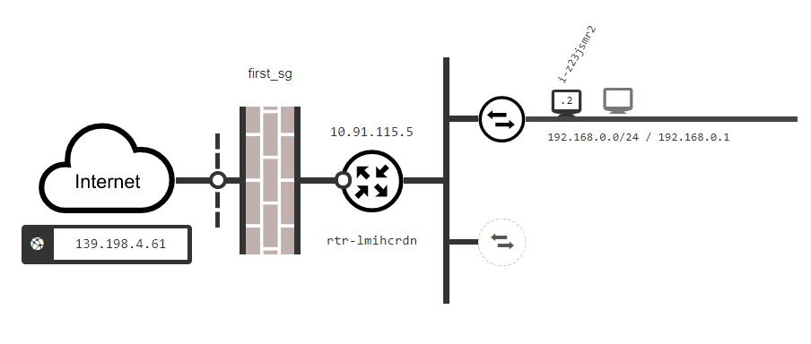
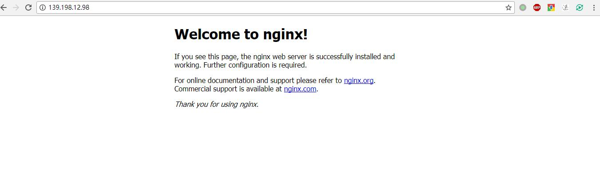

# Terraform - Infrastructure as Code

## Terraform-QingCloud使用

### 1.terraform及terraform-provider-qingcloud安装

#### 安装terraform

我们首先安装terraform，我们需要进到terraform的官网找到[适合的软件包](https://www.terraform.io/downloads.html)进行下载。  
下载Terraform后，解压压缩包。压缩包中有一个名为terraform的文件，我们只需要这个二进制文件就可以使用terraform了。  
最后一步是设置terraform的PATH。如何在Linux和Mac中设置PATH可以参考这个[页面](https://stackoverflow.com/questions/14637979/how-to-permanently-set-path-on-linux-unix)，
如何在Windows当中设置PATH可以参考这个[页面](https://stackoverflow.com/questions/1618280/where-can-i-set-path-to-make-exe-on-windows)

#### 验证terraform安装

在安装完terraform之后，我们可以打开一个新的终端来验证terraform安装成功了。  
执行`terraform`可以看到类似下面的输出：

```text
$ terraform
Usage: terraform [--version] [--help] <command> [args]

The available commands for execution are listed below.
The most common, useful commands are shown first, followed by
less common or more advanced commands. If you're just getting
started with Terraform, stick with the common commands. For the
other commands, please read the help and docs before usage.

Common commands:
    apply              Builds or changes infrastructure
    console            Interactive console for Terraform interpolations
# ...
```

#### 安装terraform-provider-qingcloud

terraform-provider-qingcloud同样是以二进制文件进行发布，我们可以到Github上找到[适合的软件包](https://github.com/yunify/terraform-provider-qingcloud/releases)进行下载。  
下载完成后里面会包含一个二进制文件，解压压缩包。  
在Linux以及Mac当中我们需要将文件名改为`terraform-provider-qingcloud`，并把这个二进制文件放到与terraform同一路径下。  
在Windows当中我们需要将文件名改为`terraform-provider-qingcloud.exe`，并把这个二进制文件放到与terraform同一路径下。 

### 2.terraform使用

我们将会介绍如何使用terraform，并且进行一键在青云平台创建下图的结构，并在主机当中运行docker以及nginx。  
 

#### 理解配置文件

像git一样，每个terraform项目都需要自己的目录，我们可以直接使用example目录进行试验。  
在example目录下面执行terraform相关命令时，terraform会加载这个目录下的`*.tf`文件。  
terraform的配置文件是HashiCorp公司的[HCL](https://github.com/hashicorp/hcl)语言。

#### terraform init

与git类似，我们需要在terraform项目的根目录运行terraform init去初始化项目。  
在初始化项目的时候，terraform会解析目录下的`*.tf`文件并加载相关的provider插件。
在example文件夹下运行`terraform init`会看到类似下面的输出：
```text
Initializing provider plugins...

The following providers do not have any version constraints in configuration,
so the latest version was installed.

To prevent automatic upgrades to new major versions that may contain breaking
changes, it is recommended to add version = "..." constraints to the
corresponding provider blocks in configuration, with the constraint strings
suggested below.

* provider.null: version = "~> 1.0"

Terraform has been successfully initialized!

You may now begin working with Terraform. Try running "terraform plan" to see
any changes that are required for your infrastructure. All Terraform commands
should now work.

If you ever set or change modules or backend configuration for Terraform,
rerun this command to reinitialize your working directory. If you forget, other
commands will detect it and remind you to do so if necessary.
```
#### 指定provider

在`./example/var.tf`文件我们指定了provider，qingcloud的provider需要`access_key`与`secret_key`进行调用API，key可以在qingcloud Web控制台进行申请。  
`zone`指定了资源会在哪个区中进行创建，默认为pek3a区。

#### 理解resource

HCL语言是一种声明式语言，即在`*.tf`文件中声明了我们所期望的资源状态。  
我们在`example/main.tf`文件当中指定了我们想要的资源以及他们的状态。  
在定义的资源的时候我们可以在一个资源当中引用其他资源的字段，terraform会自动解析这些引用并且按顺序进行创建。  
```hcl-terraform
resource "qingcloud_security_group_rule" "ssh-in" {
  security_group_id = "${qingcloud_security_group.foo.id}" //引用别名为foo的qingcloud_security_group的id
  protocol          = "tcp"
  priority          = 0
  action            = "accept"
  direction         = 0
  from_port         = 22
  to_port           = 22
}
```
在上面的例子当中，`qingcloud_security_group_rule`为资源的名称，需要provider支持特定的资源。  
`ssh-in`为资源的别名，是在这个项目当中唯一的。  
上面我们创建了一个类型为`qingcloud_security_group_rule`的资源，也就是一个防火墙规则资源。  
在这个资源中我们指定了防火墙的ID，以及规则的协议、优先级、动作、方向以及端口范围。  

* qingcloud_eip.foo:创建一个带宽为2的弹性公网IP  
* qingcloud_keypair.foo:使用`~/.ssh/id_rsa.pub`的文件内容创建一个SSH key 
* qingcloud_security_group.foo:创建一个名称为first_sg的防火墙
* qingcloud_security_group_rule.http-in:为防火墙添加一条接收80端口TCP请求的规则
* qingcloud_security_group_rule.http-in:为防火墙添加一条接收22端口TCP请求的规则
* qingcloud_vpc.foo:创建一个vpc网络，并且绑定了防火墙与弹性公网IP,VPC的子网范围为`192.168.0.0/16`
* qingcloud_vxnet:创建一个受管的vxnet，并且加入VPC当中，子网范围是`192.168.0.0/24`
* qingcloud_instance.foo:创建一个实例，绑定了上面创建的SSH key，并且加入到了vxnet当中
* qingcloud_vpc_static.http-portforward:为VPC添加一条端口转发规则，将80端口的请求转发到instance的80端口当中
* qingcloud_vpc_static.ssh-portforward:为VPC添加一条端口转发规则，将22端口的请求转发到instance的22端口当中

#### 使用Provisioners进行环境配置

Provisioners可以在资源创建/销毁时在本地/远程执行脚本。  
Provisioners通常用来引导一个资源，在销毁资源前完成清理工作，进行配置管理等。  
Provisioners可以添加在任何的resource当中：  

```hcl-terraform
resource "qingcloud_instance" "foo" {
  # ...

  provisioner "local-exec" {
    command = "echo ${self.private_ip} > file.txt"
  }
}
```

在example当中，我们使用了null_resource再加上provisioner完成了在qingcloud_instance上安装docker并启动docker-nginx。  
在`null_resource.run_docker_nginx`当中，我们指定了`depends_on`参数，保证了在所有依赖资源创建完成后再进行执行`provisioner`。  

#### 执行terraform plan查看terraform计划

`terraform plan`命令用于输出执行计划。除非明确禁用，terraform会调用refresh方法重新查询当前资源的状态。  
完成状态刷新后，terraform会自动分析要进行的操作以达到配置文件中所需要的状态，并把分析的结果输出出来。
在example文件夹下执行`terraform plan`会`得到类似下面的结果：
```text
Refreshing Terraform state in-memory prior to plan...
The refreshed state will be used to calculate this plan, but will not be
persisted to local or remote state storage.


------------------------------------------------------------------------

An execution plan has been generated and is shown below.
Resource actions are indicated with the following symbols:
  + create

Terraform will perform the following actions:

  + null_resource.run_docker_nginx
      id:                <computed>

  + qingcloud_eip.foo
      id:                <computed>
      addr:              <computed>
      bandwidth:         "2"
      billing_mode:      "bandwidth"
      need_icp:          "0"
      resource.%:        <computed>
      tag_names.#:       <computed>

  + qingcloud_instance.foo
      id:                <computed>
      cpu:               "1"
      image_id:          "centos73x64"
      instance_class:    "0"
      keypair_ids.#:     <computed>
      managed_vxnet_id:  "${qingcloud_vxnet.foo.id}"
      memory:            "1024"
      private_ip:        <computed>
      public_ip:         <computed>
      security_group_id: <computed>
      tag_names.#:       <computed>

......


Plan: 11 to add, 0 to change, 0 to destroy.

------------------------------------------------------------------------

Note: You didn't specify an "-out" parameter to save this plan, so Terraform
can't guarantee that exactly these actions will be performed if
"terraform apply" is subsequently run.

```

#### 使用terraform apply提交资源创建及配置

`terraform apply`命令用于应用所需的更改以达到所需的配置状态。
为了更加方便的得到我们所关注的输出结果，可以使用output单独输出部分字段。
如在`example/main.tf`当中，我们单独获取了`qingcloud_vpc.foo`的public_ip：

```hcl-terraform
output "ip" {
  value = "${qingcloud_vpc.foo.public_ip}"
}
```

填写example/var.tf中的`access_key`与`secret_key`后，我们使用`terraform apply`可以完成资源的创建与配置。

> 注意  
> 使用terraform apply会创建实际的资源，将会产生一些费用。

我们会在输出的结尾获取到类似下图的输出：  
   
 打开浏览器，输入output的IP，可以看到nginx以及响应请求：  
   
 
 
